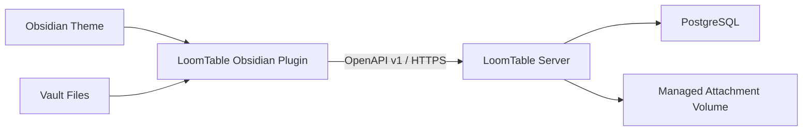

# LoomTable 架构总览

## 仓库边界

LoomTable 由两个独立仓库组成：

```text
LoomTable Obsidian Plugin
└── Obsidian 前端、UI、Grid、Map、连接、缓存和本地集成

LoomTable Server
└── Go Server、PostgreSQL、附件存储、同步协议和 OpenAPI
```

两个仓库不采用 Monorepo。`LoomTable Server` 仓库中的 OpenAPI 文件是 API 合同的唯一来源，并导入 Apifox。

## 运行时结构



## LoomTable Obsidian Plugin

Plugin 负责：

- Obsidian Workspace View 生命周期。
- Workspace、Base、Table、View 导航。
- Grid 和 Map 的呈现。
- 组件状态、键盘操作和触控操作。
- Field Editor 和 Field Renderer。
- 服务连接、Token 保存和版本检查。
- 活动 View 的刷新与本地缓存。
- Vault Attachment 的本地读取。
- 可选的 Obsidian 集成 Adapter。

Plugin 不负责：

- 直接连接 PostgreSQL。
- 把每条 Record 写成一个 Markdown 文件。
- 把 Vault 文件路径当作跨设备文件地址。
- 代替用户管理 Docker。
- 在客户端重新实现服务端的完整查询和排序。

## LoomTable Server

Server 是模块化单体，第一阶段作为一个 Go 进程部署：

```text
LoomTable Server
├── API Module
├── Auth Module
├── Catalog Module
├── Record Module
├── Attachment Module
├── Operations Module
└── PostgreSQL Adapter
```

Catalog Module 统一承载 Workspace、Base、Table、Field 与 View 的元数据不变量；Record Module 统一承载 Mutation、Query、Change 与 Map 的数据语义。模块是代码组织和职责边界，不是独立进程，HTTP 与 PostgreSQL 位于模块 seam 的 adapter 侧。详细依赖规则见[源码结构](./source-layout.md)。只有在 Team 模式出现明确的吞吐或隔离需求时，才考虑拆分后台任务或实时协作进程。

## 关键 Seam

### Plugin Client Seam

Plugin 内部使用一个小的 `LoomTableClient` Interface。生产实现是 HTTP Adapter，测试实现是内存 Fake。这个 Seam 用于隔离 Obsidian UI 与网络传输，而不是为了支持多个数据库。

### Attachment Store Seam

Server 将附件元数据与文件内容分离。启用 Attachment capability 后，第一阶段使用本地文件卷；未来可以加入 S3 或兼容对象存储 Adapter。P0 只保留该 seam，不启用业务 API。

### Tile Provider Seam

Map View 自己控制交互和 Marker 生命周期。地图瓦片通过客户端的可配置 Tile Provider 接入；地理编码是另一个可选 Adapter。两者都不绑定特定商业服务，也不经过 LoomTable Server。

### Map Query Seam

Server 只负责基于已保存 Map View 配置查询业务数据：验证 Location Field、执行 Filter、计算精确计数和 Data Bounds，并把当前 Map Viewport 归并为最多 500 个 Map Point/Map Cluster。P0 从 PostgreSQL JSONB 安全提取 WGS 84 数值并在应用层聚类，不引入 PostGIS；Server 不选择瓦片提供方、不保存临时相机，也不把内部聚类算法暴露成稳定领域合同。

### Database Access

Server 第一阶段只支持 PostgreSQL，不创建通用数据库 Interface。Repository 和 Query Module 隐藏 SQL 细节，但不假装支持 MySQL 或 SQLite。

## UI 样式原则

LoomTable 自身使用带默认值的 `--loom-*` 语义变量，并映射到 Obsidian 的主题变量。插件不依赖某个特定主题；用户启用不同 Obsidian 主题时，组件应自然继承该主题的视觉风格。

所有插件 CSS 使用 `.loom-*` 命名空间。任何外部视觉参考只用于开发和测试，不作为运行时依赖。
